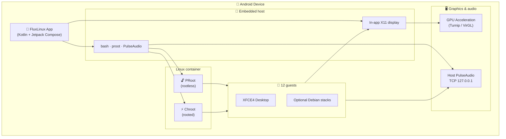

  
  <h1>FluxLinux</h1>
  
<strong>Run full Linux desktops on Android — 13 guests, PRoot or Chroot, XFCE4 or i3, X11, and PulseAudio</strong>

  
    

  
  

    

  <!-- Row 1 -->
  
  
  
  
   

  <!-- Row 2 -->
  
  
  

---

## 📱 Screenshots

  <table>
    <tr>
      <td align="center"> <b>Home</b></td>
      <td align="center"> <b>Distros</b></td>
      <td align="center"> <b>Install</b></td>
    </tr>
    <tr>
      <td align="center"> <b>Settings</b></td>
      <td align="center"> <b>Desktop</b></td>
      <td align="center"> <b>Terminal</b></td>
    </tr>
  </table>

---

## 🐧 Supported Distros

Thirteen guests. **Every one** installs as **PRoot** (no root) or **Chroot** (rooted), on the in-app X11 display with **host PulseAudio** — twelve on **XFCE4**, plus an Omarchy-style **i3** guest. Rootfs archives download on demand from the GitHub [`rootfs`](https://github.com/abhay-byte/fluxlinux/releases/tag/rootfs) tag after an in-app opt-in.

  <table>
    <tr>
      <td align="center" width="16%"> <b>Debian</b> 13 Trixie</td>
      <td align="center" width="16%"> <b>Alpine</b> 3.24</td>
      <td align="center" width="16%"> <b>Fedora</b> 44</td>
      <td align="center" width="16%"> <b>Void</b> Rolling</td>
      <td align="center" width="16%"> <b>openSUSE</b> Tumbleweed</td>
      <td align="center" width="16%"> <b>Deepin</b> 25</td>
    </tr>
    <tr>
      <td align="center"> <b>Chimera</b> musl / apk v3</td>
      <td align="center"> <b>Manjaro</b> ARM</td>
      <td align="center"> <b>Ubuntu</b> 26.04</td>
      <td align="center"> <b>Kali</b> Rolling</td>
      <td align="center"> <b>Parrot</b> 7.2</td>
      <td align="center"> <b>Arch</b> ARM</td>
    </tr>
    <tr>
      <td align="center"> <b>Omarchy-style</b> Arch ARM · i3</td>
      <td colspan="5"></td>
    </tr>
  </table>

 

| | Distro | Release | Packages | PRoot | Chroot | XFCE4 + X11 | PulseAudio |
|---|--------|---------|----------|:-----:|:------:|:-----------:|:----------:|
|  | **Debian** | 13 Trixie | apt | ✓ | ✓ | ✓ | ✓ |
|  | **Alpine** | 3.24 | apk | ✓ | ✓ | ✓ | ✓ |
|  | **Fedora** | 44 | dnf | ✓ | ✓ | ✓ | ✓ |
|  | **Void** | Rolling | xbps | ✓ | ✓ | ✓ | ✓ |
|  | **openSUSE** | Tumbleweed | zypper | ✓ | ✓ | ✓ | ✓ |
|  | **Deepin** | 25 | apt | ✓ | ✓ | ✓ | ✓ |
|  | **Chimera** | Rolling | apk v3 | ✓ | ✓ | ✓ | ✓ |
|  | **Manjaro** | ARM | pacman | ✓ | ✓ | ✓ | ✓ |
|  | **Ubuntu** | 26.04 | apt | ✓ | ✓ | ✓ | ✓ |
|  | **Kali** | Rolling | apt | ✓ | ✓ | ✓ | ✓ |
|  | **Parrot** | 7.2 | apt | ✓ | ✓ | ✓ | ✓ |
|  | **Arch** | ARM | pacman | ✓ | ✓ | ✓ | ✓ |
|  | **Omarchy-style** | Arch ARM | pacman | ✓ | ✓ | i3 + X11 | ✓ |

Debian also ships the optional extra stacks (KDE Plasma, app/web/data/game/office/graphics). Ten of the others use the shared XFCE4 + GPU + theme path.

**Omarchy-style** is the exception: it reuses the Arch Linux ARM rootfs but runs **i3** with polybar, rofi, dunst and the Omarchy CLI stack in Tokyo Night. It is inspired by [Omarchy](https://omarchy.org), not built from it — upstream is x86_64-only and its desktop is Hyprland, a Wayland compositor that cannot attach to the app's X11 display. See [docs/distro/omarchy.md](docs/distro/omarchy.md).

Per-distro notes: [docs/distro/](docs/distro/).

---

## 🚀 Vision

Modern Android hardware is powerful enough to run desktop workloads, but the software ecosystem limits it. **FluxLinux** bridges this gap, enabling:

- 🌐 **Full-Stack Web Development** — Node.js, Python, React, VS Code
- 🎮 **Desktop Gaming** — Box64/Wine *(coming soon)*
- 🔐 **Cybersecurity** — Nmap, Wireshark, Metasploit
- 📊 **Data Science** — Jupyter, TensorFlow, PyTorch
- 🎨 **Creative Tools** — GIMP, Blender, Inkscape
- 📄 **Productivity** — LibreOffice, Firefox Desktop

---

## ✨ Key Features

| Feature | Description |
|---------|-------------|
| 🐧 **12 Distros** | Debian, Alpine, Fedora, Void, openSUSE, Deepin, Chimera, Manjaro, Ubuntu, Kali, Parrot, Arch — each PRoot and Chroot |
| 🖥️ **XFCE4 + X11** | In-app X11 display (no external Termux:X11). XFCE4 on every guest |
| 🔊 **PulseAudio** | Host Pulse as the app uid; guests connect over `127.0.0.1` TCP |
| 🔓 **Rootless Mode** | Works on any Android 8+ device via PRoot |
| ⚡ **Turbo Mode** | Native chroot for rooted devices (Magisk / KernelSU / APatch BusyBox) |
| 🎮 **GPU Acceleration** | Turnip (Adreno) + VirGL for graphics |
| 🎨 **Custom Themes** | XFCE4 Space theme, Papirus icons, wallpapers |
| 📦 **Dev Stacks** | Extra Debian environments for coding, office, and graphics |

---

## 🖼️ Desktop Experience

  
  
<em>Full XFCE4 desktop with hardware acceleration</em>

### 🚀 Development in Action

<table>
<tr>
<td align="center"> <b>Flutter Development</b></td>
<td align="center"> <b>React Web App</b></td>
</tr>
<tr>
<td align="center"> <b>Jupyter + TensorFlow</b></td>
<td align="center"> <b>Kotlin/Gradle Build</b></td>
</tr>
<tr>
<td align="center"> <b>GIMP Image Editor</b></td>
<td align="center"> <b>LibreOffice Writer</b></td>
</tr>
<tr>
<td align="center" colspan="2"> <b>Pitivi Video Editor</b></td>
</tr>
</table>

### Included Development Stacks

  <table>
    <tr>
      <td align="center">🌐 <b>Web Dev</b> Node.js, React, VS Code</td>
      <td align="center">📱 <b>App Dev</b> Flutter, Kotlin, Android SDK</td>
      <td align="center">🧬 <b>Data Science</b> Jupyter, TensorFlow</td>
    </tr>
    <tr>
      <td align="center">🎮 <b>Game Dev</b> Godot Engine</td>
      <td align="center">🔐 <b>Security</b> Kali Tools</td>
      <td align="center">🎨 <b>Graphics</b> GIMP, Blender</td>
    </tr>
  </table>

---

## 🛠 Architecture

---

## 📚 Documentation

| Document | Description |
|----------|-------------|
| [**Setup & Onboarding Guide**](docs/tutorial/setup_fluxlinux.md) | Step-by-step visual installation tutorial |
| [**Debian PRoot Setup Guide**](docs/tutorial/setup_debian_proot.md) | Step-by-step Debian PRoot configuration tutorial |
| [**Debian Chroot Setup Guide**](docs/tutorial/setup_debian_chroot.md) | Step-by-step Debian Chroot configuration tutorial |
| [**Distro reference**](docs/distro/) | Per-guest notes (Alpine, Fedora, Ubuntu, Kali, …) |
| [**Installation Reference**](docs/install_ref/) | Packages, paths, versions, environments |
| [**Scripts Reference**](docs/scripts_reference.md) | All installation and setup scripts |
| [**Hardware Acceleration**](docs/hardware_acceleration.md) | GPU setup guide (Turnip/VirGL) |
| [**Script Execution Workflow**](docs/script_execution_workflow.md) | How scripts are executed |
| [**Testing Reference**](docs/testing_reference.md) | Sample projects for testing |
| [**Assets Reference**](docs/assets_reference.md) | Themes, icons, wallpapers, rootfs |
| [**Architecture**](docs/architecture.md) | System design overview |
| [**Roadmap**](docs/roadmap.md) | Development roadmap |

---

## 📦 Installation

### Requirements

- Android 8.0+ (API 26+)
- No external Termux or Termux:X11 APK — host shell, PRoot, X11, and PulseAudio ship inside FluxLinux
- Chroot needs a rooted device with Magisk, KernelSU, or APatch BusyBox

### Install

1. Get FluxLinux from [F-Droid](https://f-droid.org/packages/com.ivarna.fluxlinux), [Google Play](https://play.google.com/store/apps/details?id=com.zenithblue.fluxlinux), or [GitHub Releases](https://github.com/abhay-byte/fluxlinux/releases)
2. Open the app and finish the first-run host setup
3. Pick a distro and install as PRoot or Chroot — the rootfs downloads after you opt in

  
  
<em>Easy setup wizard</em>

---

## 🎮 GPU Acceleration

FluxLinux supports hardware-accelerated graphics:

<table>
<tr>
<td width="50%">

| GPU Type | Driver | Performance |
|----------|--------|-------------|
| Adreno (Qualcomm) | Turnip + Zink | 🟢 Excellent |
| Mali (ARM) | VirGL | 🟡 Good |
| Mali/PowerVR (MediaTek) | VirGL | 🟡 Good |
| Other | VirGL | 🟡 Good |

📖 [Hardware Acceleration Guide](docs/hardware_acceleration.md)

</td>
<td width="50%" align="center">

 <em>GPU Driver Selection</em>

</td>
</tr>
</table>

---

## 🤝 Contributing

Contributions are welcome! Please check the [Roadmap](docs/roadmap.md) to see active development phases.

1. Fork the repository
2. Create your feature branch (`git checkout -b feature/AmazingFeature`)
3. Commit your changes (`git commit -m 'Add some AmazingFeature'`)
4. Push to the branch (`git push origin feature/AmazingFeature`)
5. Open a Pull Request

---

## 📄 License

This project is licensed under the **GNU General Public License v3.0 (GPLv3)**.

See [LICENSE](LICENSE) for details.

**Embedded components:** The in-app terminal stack bundles [termux-app](https://github.com/termux/termux-app) v0.118.0 (GPLv3) for `TerminalSession`/`TerminalView`; host userland packages are rebuilt from the Termux package repo (`native/`). FluxLinux remains open source under GPLv3, consistent with these dependencies.

---

  
Made with ❤️ by <a href="https://github.com/abhay-byte">Abhay Raj</a>

  

    <a href="https://github.com/abhay-byte/fluxlinux">GitHub</a> •
    <a href="https://github.com/abhay-byte/fluxlinux/issues">Issues</a> •
    <a href="docs/">Documentation</a> •
    <a href="https://discord.gg/tag9kXAs2x">Discord</a>
  

---

  
   
  
<strong>Get help, share setups, and discuss features</strong>

